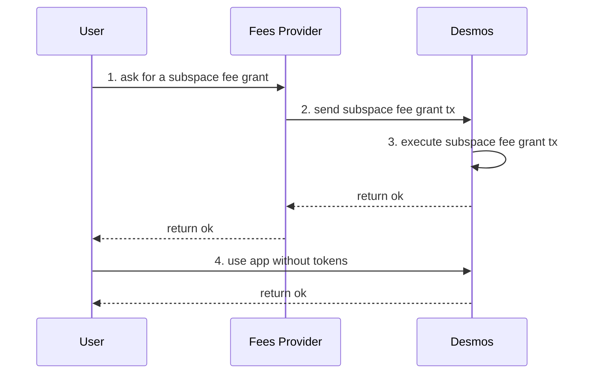
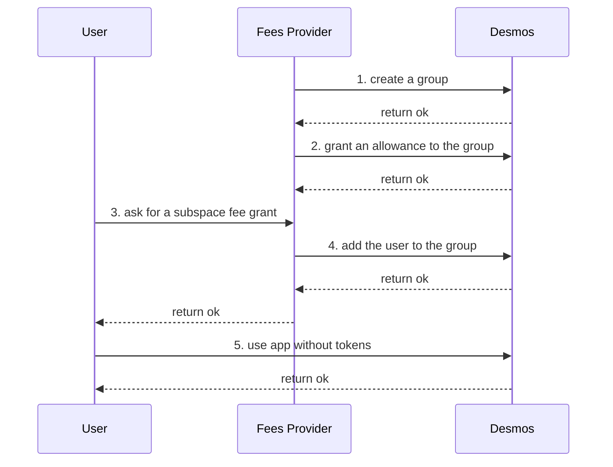
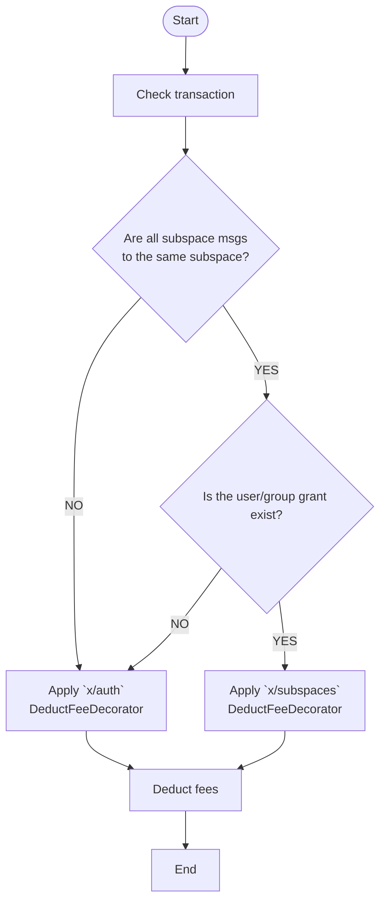

# ADR 017: Subspace fee grant

## Changelog

- Nov 14th, 2022: First draft;
- Nov 21th, 2022: First reviewed.

## Status

PROPOSED

## Abstract

This ADR introduces a new subspace-based fee grant method, which allows subspace service providers to pay the fees of subspace related transactions for the users.

## Context

Currently, one of the major problems of current Web3 services is complicated to use, it requires users to have tokens paying transaction fees so that they can use the service. For instance, in order to create a post on Desmos-based social network, users have to understand:
- what `transaction` is and why they need some DSM to broadcast it;
- get some DSM either via an on-ramp or by swapping existing funds.

The `x/feegrant` gives the possibility to pay fees for the users, meaning that users can use the service without understanding how Web3 works behind. However, the `x/feegrant` allowance is not subspace-specified so subspace fees providers might unexpected pay the fees of the transactions to any other subspaces.

## Decision

We will implement a subspace-specified fee grant process based on `x/feegrant` that allows subspace fees providers to pay fees for the users inside the specified subspace. The process of a subspace fees provider supports a user fees will be as follows:
1. the user asks fees provider a fee grant inside the specified subspace;
2. the fees provider send a subspace fee grant transaction to Desmos;
3. Desmos executes the subspace fee grant transaction successfully;
4. the user can use the service without any tokens inside the specified subspace, the fees will be paid by the fees provider.



In order to simplify the allowance management for the fees providers, we will also implement the subspace group fee grant to allow fees providers to grant an allowance to a group, then all the users in the group can share the grant. The process of the user asks for a group fee grant will be like:
1. the fees provider creates a group;
2. the fees provider grants an allowance to the group;
3. the user asks for a subspace group fee grant;
4. the fee provider adds the user to the group;
5. the user can use the service without any tokens inside the specified subspace, the fees will be paid by the fees provider.


### DeductFeeDecorator

Currently, `x/auth` provides a `DeductFeeDecorator` based on `x/feegrant` to execute the action deducting the fees of a transaction from the signer/feepayer. We will build a new subspace-specified `DeductFeeDecorator` to replace the current one.

The new subspace-specified `DeductFeeDecorator` will deal with the fees with the process as follows:
1. check all the messages in the transaction are the subspace messages and all of them are to the same subspace;
2. apply `x/subspaces` `DeductFeeDecorator` if the transaction contains subspace messages from the same subspace and the user/group fee grant exists, or apply `x/auth` `DeductFeeDecorator`;
3. deduct the fees from the fee payer.



### Types

#### Allowance

Currently, `x/feegrant` provides an interface `FeeAllowanceI` and the implementations for the interface like `BasicAllowance`, `AllowedMsgAllowance` and `PeriodicAllowance`. Each of them already have the operation process to deal with the allowance. We will reuse them to be the allowance object inside the `x/subspace`.

#### Grant

As `Allowance`, `x/feegrant` has `Grant` object to record all full context, which contains `granter`, `grantee` and what kind of `allowance` is granted. We will reuse it to store in the subspace namespace KVStore.

#### GroupGrant

To show the group grant, we will implement the `GroupGrant` object to record all full context containing `granter`, `group_id` and what kind of `allowance` is granted, the structure will be as follows:
```protobuf
message GroupGrant {
    // granter is the address of the user granting an allowance of their funds.
  string granter = 1 [(cosmos_proto.scalar) = "cosmos.AddressString"];

  // the id of the group being granted an allowance of another user's funds.
  uint32 group_id = 2;

  // allowance can be any of basic, periodic, allowed fee allowance.
  google.protobuf.Any allowance = 3 [(cosmos_proto.accepts_interface) = "FeeAllowanceI"];
}
```

### Store

#### Group grant

In order to simplify granters to manage the group allowance, the granted group allowance will be stored in the keys having the structure like:
```
SubspaceGroupAllowancePrefix | SubspaceID | GranterAddress | GroupID | -> Protobuf(GroupGrant)
```

This structure allows granters to easily manage the group allowance inside a subspace by iterating over all allowances for the granters, which will be the most used query. In the other hand, grantees must know who the granter is when using the application, they can find their grant with O(N) time complexity, N is the number of granted groups by the granter.

#### User grant

Each subspace fee granted allowance will be stored in the keys having the structure as follows:
```
SubspaceUserAllowancePrefix | SubspaceID | GranterAddress | GranteeAddress |-> Protobuf(Grant)
```

This structure allows granters to easily manage their grants inside a subspace by iterating over all grants for the granters, which will be the most used query. In the other hand, grantees must know who the granter is when using the application, they can directly find their grant with O(1) time complexity.


### `Msg` Service

In order to allow subspace fees providers to grant an allowance for the users, we will have the following operations:

- grant an allowance to a user
- revoke an allowance to a user
- grant an allowance to a group
- revoke an allowance to a group

```protobuf
service Msg {
    // GrantUserAllowance allows the granter to grant a fee allowance to the grantee.
    rpc GrantUserAllowance(MsgGrantUserAllowance) returns(MsgGrantUserAllowanceResponse);

    // RevokeUserAllowance allows a granter to revoke any existing allowance that has to been granted to the grantee.
    rpc RevokeUserAllowance(MsgRevokeUserAllowance) returns(MsgRevokeUserAllowanceResponse);

    // GrantGroupAllowance allows the granter to grant a fee allowance to the group.
    rpc GrantGroupAllowance(MsgGrantGroupAllowance) returns(MsgGrantGroupAllowanceResponse);

    // RevokeGroupAllowance allows a granter to revoke any existing allowance that has to been granted to the group.
    rpc RevokeGroupAllowance(MsgRevokeGroupAllowance) returns(MsgRevokeGroupAllowanceResponse);
}

// MsgGrantUserAllowance adds permissions for the grantee to spend up allowance of fees from the granter inside the given subspace.
message MsgGrantUserAllowance {
    // the id of the subspace where the granter grants the allowance to the grantee.
    uint64 subspace_id = 1;

    // the address of the user granting an allowance of their funds.
    string granter = 2;

    // the address of the user being granted an allowance of another user's funds.
    string grantee = 3;

    // allowance can be any of fee allowances which implements FeeAllowanceI.
    google.protobuf.Any allowance = 4 [(cosmos_proto.accepts_interface) = "FeeAllowanceI"];
}

// MsgGrantUserAllowanceResponse defines the Msg/GrantAllowanceResponse response type.
message MsgGrantUserAllowanceResponse {}

// MsgRevokeUserAllowance removes any existing allowance from granter to the grantee inside the subspace.
message MsgRevokeUserAllowance {
    // the id of the subspace where the granter grants the allowance to the grantee.
    uint64 subspace_id = 1;

    // the address of the user granting an allowance of their funds.
    string granter = 2;

    // the address of the user being granted an allowance of another user's funds.
    string grantee = 3;
}

// MsgRevokeUserAllowanceResponse defines the Msg/RevokeAllowanceResponse response type.
message MsgRevokeUserAllowanceResponse {}

// MsgGrantGroupAllowance adds permissions for the group to spend up allowance of fees from the granter inside the given subspace.
message MsgGrantGroupAllowance {
    // the id of the subspace where the granter grants the allowance to the grantee.
    uint64 subspace_id = 1;

    // the id of the group being granted an allowance of another user's funds.  
    uint32 group_id = 2;

    // the address of the user granting an allowance of their funds.
    string granter = 3;

    // allowance can be any of fee allowances which implements FeeAllowanceI.
    google.protobuf.Any allowance = 4 [(cosmos_proto.accepts_interface) = "FeeAllowanceI"];
}

// MsgGrantGroupAllowanceResponse defines the Msg/GrantAllowanceResponse response type.
message MsgGrantGroupAllowanceResponse {}

// MsgRevokeGroupAllowance removes any existing allowance from granter to the group inside the subspace.
message MsgRevokeGroupAllowance {
    // the id of the subspace where the granter grants the allowance to the group.
    uint64 subspace_id = 1;

    // the id of the group being granted an allowance of another user's funds.
    uint32 group_id = 2;

    // the address of the user granting an allowance of their funds.
    string granter = 3;
}

// MsgRevokeGroupAllowanceResponse defines the Msg/RevokeAllowanceResponse response type.
message MsgRevokeUserAllowanceResponse {}
```

### `Query` Service

In order to allow clients to easily query for allowances we will implement a new queries:

```protobuf
service Query {
    // UserAllowances returns all the grants for users.
    rpc UserAllowances(QueryUserAllowancesRequest) returns (QueryAllowancesResponse) {
        option (google.api.http).get = "/desmos/subspaces/v3/subspaces/{subspace_id}/granter/{granter}/users/allowances";
    }
    // GroupAllowances returns all the grants for groups.
    rpc GroupAllowances(QueryGroupAllowancesRequest) returns(QueryGroupAllowancesResponse) {
        option (google.api.http).get = "/desmos/subspaces/v3/subspaces/{subspace_id}/granter/{granter}/groups/allowances";
    }
}

// QueryUserAllowancesRequest is the request type for the Query/UserAllowances RPC method.
message QueryUserAllowancesRequest {
    // the id of the subspace where the granter grants the allowance to the grantee.
    uint64 subspace_id = 1;

    // the address of the user granting an allowance of their funds.
    string granter = 2;

    // (Optional) the address of the user being granted an allowance of another user's funds.
    string grantee = 3;

    // pagination defines an pagination for the request.
    cosmos.base.query.v1beta1.PageRequest pagination = 4;
}

// QueryUserAllowancesResponse is the response type for the Query/UserAllowances RPC method.
message QueryUserAllowancesResponse {
    // allowances are allowance's granted for grantee by granter.
    repeated cosmos.feegrant.v1beta1.Grant allowances = 1;

    // pagination defines an pagination for the response.
    cosmos.base.query.v1beta1.PageResponse pagination = 2;
}

// QueryGroupAllowancesRequest is the request type for the Query/GroupAllowances RPC method.
message QueryGroupAllowancesRequest {
    // the id of the subspace where the granter grants the allowance to the grantee.
    uint64 subspace_id = 1;

    // the address of the user granting an allowance of their funds.
    string granter = 2;

    // (Optional) the id of the group being granted an allowance of another user's funds.
    uint32 group_id = 3;

    // pagination defines an pagination for the request.
    cosmos.base.query.v1beta1.PageRequest pagination = 4;
}

// QueryGroupAllowancesResponse is the response type for the Query/GroupAllowances RPC method.
message QueryGroupAllowancesResponse {
    // allowances are allowance's granted for grantee by granter.
    repeated cosmos.subspace.v3.GroupGrant allowances = 1;

    // pagination defines an pagination for the response.
    cosmos.base.query.v1beta1.PageResponse pagination = 2;
}
```

## Consequences

### Backwards Compatibility

The proposed solution introduces a new set of store keys, it is completely backward compatible.

### Positive

- Allow subspace fee providers to grant fees allowances to their users.

### Negative

- Storing extra subspace grant info takes up more storage space;
- Having more check in the deducting fees phase slow down the transaction operation;
- Removing expired allowances at the block begin phase increases the block production time.  

### Neutral

- Not known

## References
https://docs.cosmos.network/v0.46/modules/feegrant/01_concepts.html