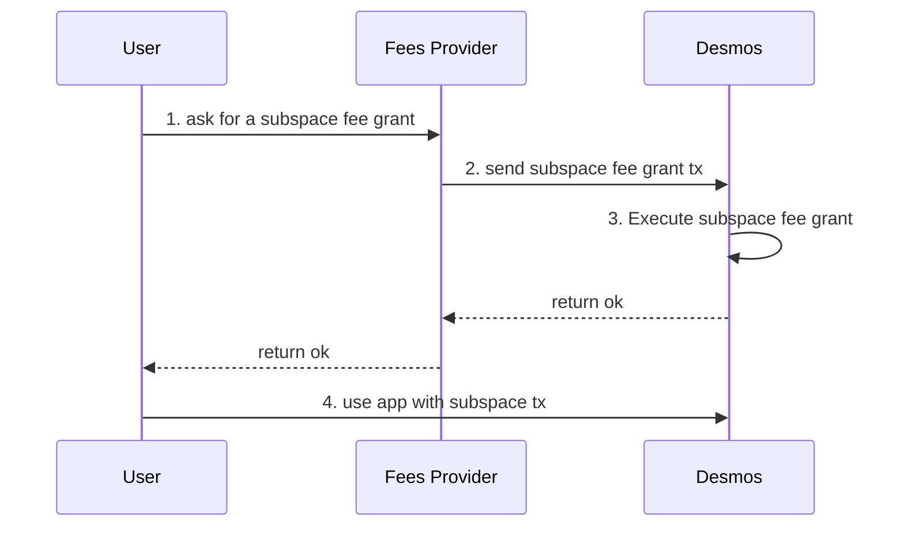
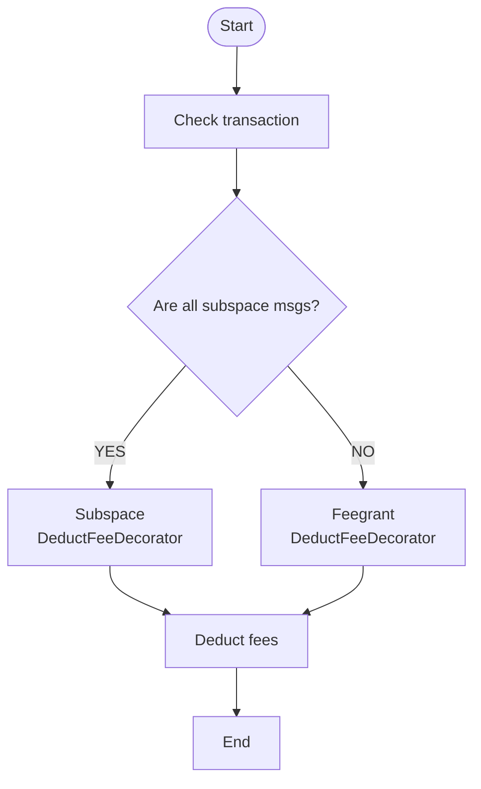

# ADR 017: Subspace fee grant

## Changelog

- Nov 14th, 2022: First draft

## Status

PROPOSED

## Abstract

This ADR introduces a new subspace-based fee grant method, which allows subspace service providers to pay the fees of subspace related transactions for the users.

## Context

Currently, one of the major problems of current Web3 services is complicated to use, it requires users to have tokens paying transaction fees so that they can use the service. For instance, in order to create a post on Desmos-based social network, users have to understand:
- what `transaction` is and why they need some DSM to broadcast it;
- get some DSM either via an on-ramp or by swapping existing funds.

The `x/feegrant` gives the possibility to pay fees for the users, meaning that users can use the service without understanding how Web3 works behind, but the fee grant allowance is not subspace-specified so subspace fees provider might unexpected pay the fees of the transactions inside another subspace.

## Decision

We will implement a subspace-specified fee grant process base on `x/feegrant` that allows subspace fees provider to pay fees for the users inside the specified subspace. The process of that a subspace fees provider support a user fees will be as follows:
1. the user asks fees provider a fee grant inside the specified subspace;
2. the fees provider send a subspace fee grant transaction to Desmos;
3. Desmos executes the subspace fee grant transaction successfully;
4. the user can use the service without any tokens inside the specified subspace, the fees will be paid by the fees provider.



### DeductFeeDecorator

Currently, `x/auth` provides a `DeductFeeDecorator` based on `x/feegrant` to execute the action deducting fees from the signer/feepayer of a transaction. We will build a new subspace-specified `DeductFeeDecorator` to replace the current one.

The new subspace-specified `DeductFeeDecorator` will operate the fees with the process as follows:



### Types

Currently, `x/feegrant` provides the `FeeAllowanceI` and the implementations for it, like `BasicAllowance`, `AllowedMsgAllowance` and `PeriodicAllowance`. Each of them already have the operation process to deal with the allowance. We will reuse them to be the allowance object inside the `x/subspace`.

### `Msg` Service

```proto
service Msg {
    rpc GrantAllowance(MsgGrantAllowance) returns(MsgGrantAllowanceResponse);
    rpc RevokeAllowance(MsgRevokeAllowance) returns(MsgRevokeAllowanceResponse);
}

message MsgGrantAllowance {
    uint64 subspace_id = 1;
    string granter = 2;
    string grantee = 3;
    google.protobuf.Any allowance = 4 [(cosmos_proto.accepts_interface) = "FeeAllowanceI"];
}

message MsgGrantAllowanceResponse {}

message MsgRevokeAllowance {
    uint64 subspace_id = 1;
    string granter = 2;
    string grantee = 3;
}

message MsgRevokeAllowanceResponse {}
```

### Store
Each subspace fee granted allowance will be stored in the keys having the structure as follows:
```
SubspaceAllowancePrefix | SubspaceID | GranterAddress | GranteeAddress |-> Protobuf(Grant)
```

This would allow granters to easily manage their grants inside a subspace by iterating over all grants for the granters, which will be the most used query. In the other hand, grantees must know who the granter is when using the application, they can directly find their grant with O(1) time complexity.

### `Query` Service

## Consequences

### Backwards Compatibility

### Positive

### Negative

### Neutral

## Test Cases [optional]

## References