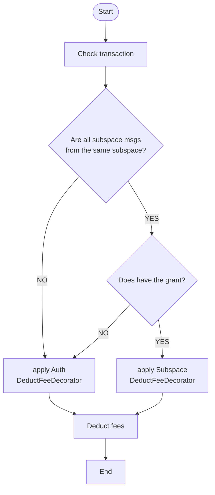

# ADR 017: Subspace fee grant

## Changelog

- Nov 14th, 2022: First draft

## Status

PROPOSED

## Abstract

This ADR introduces a new subspace-based fee grant method, which allows subspace service providers to pay the fees of subspace related transactions for the users.

## Context

Currently, one of the major problems of current Web3 services is complicated to use, it requires users to have tokens paying transaction fees so that they can use the service. For instance, in order to create a post on Desmos-based social network, users have to understand:
- what `transaction` is and why they need some DSM to broadcast it;
- get some DSM either via an on-ramp or by swapping existing funds.

The `x/feegrant` gives the possibility to pay fees for the users, meaning that users can use the service without understanding how Web3 works behind. However, the fee grant allowance is not subspace-specified so subspace fees provider might unexpected pay the fees of the transactions inside another subspace.

## Decision

We will implement a subspace-specified fee grant process base on `x/feegrant` that allows subspace fees provider to pay fees for the users inside the specified subspace. The process of that a subspace fees provider support a user fees will be as follows:
1. the user asks fees provider a fee grant inside the specified subspace;
2. the fees provider send a subspace fee grant transaction to Desmos;
3. Desmos executes the subspace fee grant transaction successfully;
4. the user can use the service without any tokens inside the specified subspace, the fees will be paid by the fees provider.


### DeductFeeDecorator

Currently, `x/auth` provides a `DeductFeeDecorator` based on `x/feegrant` to execute the action deducting fees from the signer/feepayer of a transaction. We will build a new subspace-specified `DeductFeeDecorator` to replace the current one.

The new subspace-specified `DeductFeeDecorator` will operate the fees with the process as follows:
1. check all the messages in the transaction are the subspace messages and all of them are to the same subspace;
2. apply `x/subspaces` `DeductFeeDecorator` if the transaction contains subspace messages from the same subspace and the grant exists, or apply `x/auth` `DeductFeeDecorator`;
3. deduct the fees from the fee payer.



### Types

#### Allowance

Currently, `x/feegrant` provides the `FeeAllowanceI` and the implementations for it, like `BasicAllowance`, `AllowedMsgAllowance` and `PeriodicAllowance`. Each of them already have the operation process to deal with the allowance. We will reuse them to be the allowance object inside the `x/subspace`.

#### Grant

As `Allowance`, `x/feegrant` has `Grant` object to record all full context, which contains `granter`, `grantee` and what kind of `allowance` is granted. We will reuse it to store in the subspace namespace KVStore.

### Store
Each subspace fee granted allowance will be stored in the keys having the structure as follows:
```
SubspaceAllowancePrefix | SubspaceID | GranterAddress | GranteeAddress |-> Protobuf(Grant)
```

This would allow granters to easily manage their grants inside a subspace by iterating over all grants for the granters, which will be the most used query. In the other hand, grantees must know who the granter is when using the application, they can directly find their grant with O(1) time complexity.

### `Msg` Service

In order to allow subspace fees providers to grant an allowance for the users, we will have the following operations:

- grant an allowance
- revoke an allowance  

```protobuf
service Msg {
    // GrantAllowance allows the granter to grant a fee allowance to the grantee.
    rpc GrantAllowance(MsgGrantAllowance) returns(MsgGrantAllowanceResponse);

    // RevokeAllowance allows a granter to revoke any existing allowance that has to been granted to the grantee.
    rpc RevokeAllowance(MsgRevokeAllowance) returns(MsgRevokeAllowanceResponse);
}

// MsgGrantAllowance adds permission for the grantee to spend up allowance of fees from the granter inside the given subspace.
message MsgGrantAllowance {
    // the id of the subspace where the granter grants the allowance to the grantee.
    uint64 subspace_id = 1;

    // the address of the user granting an allowance of their funds.
    string granter = 2;

    // the address of the user being granted an allowance of another user's funds.
    string grantee = 3;

    // allowance can be any of fee allowances which implements FeeAllowanceI.
    google.protobuf.Any allowance = 4 [(cosmos_proto.accepts_interface) = "FeeAllowanceI"];
}

// MsgGrantAllowanceResponse defines the Msg/GrantAllowanceResponse response type.
message MsgGrantAllowanceResponse {}

// MsgRevokeAllowance removes any existing allowance from granter to grantee inside the subspace.
message MsgRevokeAllowance {
    // the id of the subspace where the granter grants the allowance to the grantee.
    uint64 subspace_id = 1;

    // the address of the user granting an allowance of their funds.
    string granter = 2;

    // the address of the user being granted an allowance of another user's funds.
    string grantee = 3;
}

// MsgRevokeAllowanceResponse defines the Msg/RevokeAllowanceResponse response type.
message MsgRevokeAllowanceResponse {}
```

### `Query` Service

In order to allow clients to easily query for allowances we will implement a new query:

```protobuf
service Query {
    // Allowances returns all the grants .
    rpc Allowances(QueryAllowancesRequest) returns (QueryAllowancesResponse) {
        option (google.api.http).get = "/desmos/subspaces/v3/subspaces/{subspace_id}/granter/{granter}/allowances";
    }
}

// QueryAllowancesRequest is the request type for the Query/Allowances RPC method.
message QueryAllowancesRequest {
    // the id of the subspace where the granter grants the allowance to the grantee.
    uint64 subspace_id = 1;

    // the address of the user granting an allowance of their funds.
    string granter = 2;

    // (Optional) the address of the user being granted an allowance of another user's funds.
    string grantee = 3;

    // pagination defines an pagination for the request.
    cosmos.base.query.v1beta1.PageRequest pagination = 4;
}

// QueryAllowancesResponse is the response type for the Query/Allowances RPC method.
message QueryAllowancesResponse {
    // allowances are allowance's granted for grantee by granter.
    repeated cosmos.feegrant.v1beta1.Grant allowances = 1;

    // pagination defines an pagination for the response.
    cosmos.base.query.v1beta1.PageResponse pagination = 2;
}
```

## Consequences

### Backwards Compatibility

The proposed solution introduces a new set of store keys, it is completely backward compatible.

### Positive

- Allow subspace fee providers to grant fees allowances to their users.

### Negative

- Storing extra subspace grant info takes up more storage space;
- Having more check in the deducting fees phase slow down the transaction operation.

### Neutral

- Not known

## References
https://docs.cosmos.network/v0.46/modules/feegrant/01_concepts.html