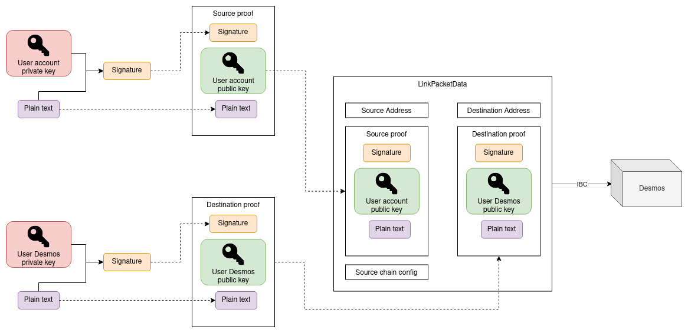

# Chain link
A chain link represents a link to an external chain account that has been created by the user to connect their Desmos profile to such accounts. These links can be created either offline or using IBC following the specification described inside the [_"Create a chain link"_ section](#create-a-chain-link).

## Contained data
Here follows the data contained inside a chain link.

### `User` (`string`)
Represents the Desmos address to which the chain link is associated.

### `Address` (`object`)
Contains the data of the external chain address. Currently, it can be of two different types:

- `Bech32Address` to represent Bech32-based addresses
- `Base58Address` to support Base58-encoded addresses

### `Proof` (`object`)
Contains the data proving the ownership of the external chain account.

- #### `PubKey` (`object`)
  Contains the data of the public key associated with the external address that is used to verify the ownership of such address.

- #### `Signature` (`string`)
  Represents the hex-encoded signature of the plain text that has been created signing it with the private key
  associated with the provided public key.

- #### `PlainText` (`string`)
  Represents the hex-encoded plain text value that has been signed with the private key associated with the
  specified `Address` in order to generate the `signature` value.

### `ChainConfig` (`object`)
Contains the details of the external chain to which the link is associated.

- #### `Name` (`string`)
  Represents the human-readable chain name.

### `CreationTime` (`time`)
Represents the time in which the link has been created.

## Create a chain link
### 1. Create the ownership proofs
When creating a chain link, you need to provide two different proofs to make sure the link is valid:

1. The proof that you own the external chain account;
2. The proof that you own the Desmos profile to which you want to link.

In order to create a proof, the following steps are needed:

1. Get a generic plain text data to sign;
2. Sign the plain text data using your private key;
3. Assemble the signature, plain text and public key into a `Proof` object.

Here is an example of a valid proof object encoded using JSON:

```json
{
    "pub_key": {
        "@type": "/cosmos.crypto.secp256k1.PubKey",
        "key": "A58DXR/lXKVkIjLofXgST/OHi+pkOQbVIiOjnTy7Zoqo"
    },
    "signature": "ecc6175e730917fb289d3a9f4e49a5630a44b42d972f481342f540e09def2ec5169780d85c4e060d52cc3ffb3d677745a4d56cd385760735bc6db0f1816713be",
    "plain_text": "cosmos15uc89vnzufu5kuhhsxdkltt38zfx8vcyggzwfm"
}
```

Note that the `pub_key` field must be encoded using Protobuf and must be compatible with the public key types that are
currently supported by Cosmos. You can see a list of such key
types [here](https://github.com/cosmos/cosmos-sdk/tree/master/proto/cosmos/crypto).

### 2. Create the link
Once you have created the two ownership proofs, you are now ready to create the link. This can be done in two ways:

1. [Using IBC](#using-ibc);
2. [Using the CLI](#using-the-cli).

#### Using IBC
This is the way that you want to use when integrating the Desmos connection from your chain.  
To implement the IBC capability of connecting an external account to a Desmos profile, the `x/profiles` module supports
the following packet data type:

##### LinkChainAccountPacketData
`LinkChainAccountPacketData` defines the object that should be sent inside a
`MsgSendPacket` when wanting to link an external chain to a Desmos profile using IBC.

```golang
type LinkChainAccountPacketData struct {

    // SourceAddress contains the details of the external chain address
    SourceAddress *types.Any `protobuf:"bytes,1,opt,name=source_address,json=sourceAddress,proto3" json:"source_address,omitempty" yaml:"source_address"`
    
    // SourceProof represents the proof of ownership of the source address
    SourceProof Proof `protobuf:"bytes,2,opt,name=source_proof,json=sourceProof,proto3" json:"source_proof" yaml:"source_proof"`
    
    // SourceChainConfig contains the details of the source chain
    SourceChainConfig ChainConfig `protobuf:"bytes,3,opt,name=source_chain_config,json=sourceChainConfig,proto3" json:"source_chain_config" yaml:"source_chain_config"`
    
    // DestinationAddress represents the Desmos address of the profile that should
    // be linked with the external account
    DestinationAddress string `protobuf:"bytes,4,opt,name=destination_address,json=destinationAddress,proto3" json:"destination_address,omitempty" yaml:"destination_address"`
    
    // DestinationProof contains the proof of ownership of the DestinationAddress
    DestinationProof Proof `protobuf:"bytes,5,opt,name=destination_proof,json=destinationProof,proto3" json:"destination_proof" yaml:"destination_proof"`
}
```

|        Field         |     Type      | Description                                                       |
|:--------------------:|:-------------:|:------------------------------------------------------------------|
|   `SourceAddress`    | `AddressData` | Contains the details of the external address to be linked         |
|    `SourceProof`     |    `Proof`    | Contains the data to verify the ownership of the external address |
| `SourceChainConfig`  | `ChainConfig` | Contains the data of the external chain to be linked              |
| `DestinationAddress` |   `string`    | Desmos address of the profile to which link the external address  |
|  `DestinationProof`  |    `Proof`    | Proof of ownership of the Desmos profile                          | 

Note that the `SourceAddress` field must be one of the currently supported types:

- `Base58Address` if the external address is represented by the Base58 encoded public key of the account;
- `Bech32Address` if the external address is Bech32 encoded.

The overall view is the following:



#### Using the CLI
You can easily create a chain link using the CLI by running two commands:

1.`desmos create-chain-link-json`
This will start an interactive prompt session allowing you to generate the proper JSON file containing all the linkage
information.

2. `desmos tx profiles link-chain [/path/to/link_file.json]`
   This will effectively link your Desmos profile to the external chain address. The required argument is the (absolute)
   path to the file generated using the `create-chain-link-json` command. 
