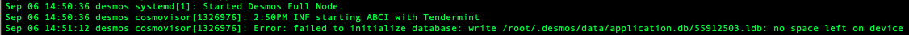
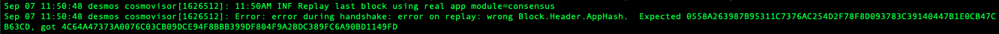

# Common Problems

## Problem #1: My validator has `voting_power: 0`
Your validator has become jailed. Validators get jailed, i.e. get removed from the active validator set, if they do not
vote on `500` of the last `10000` blocks, or if they double sign.

If you got jailed for downtime, you can get your voting power back to your validator. First, if `desmos` is not running,
start it up again:

```bash
desmos start
```

Wait for your full node to catch up to the latest block. Then, you
can [unjail your validator](#problem-4-my-validator-is-jailed).

Lastly, check your validator again to see if your voting power is back.

```bash
desmos status
```

You may notice that your voting power is less than it used to be. That's because you got slashed for downtime!

## Problem #2: My `desmos` crashes because of `too many open files`

The default number of files Linux can open (per-process) is `1024`. `desmos` is known to open more than `1024` files.
This causes the process to crash. A quick fix is to run `ulimit -n 4096` (increase the number of open files allowed) and
then restart the process with `desmos start`. If you are using `systemd` or another process manager to launch `desmos`
this may require some configuration at that level. A sample `systemd` file to fix this issue is below:

```{12}
# /etc/systemd/system/desmos.service
[Unit]
Description=Desmos Full Node
After=network.target

[Service]
Type=simple
User=ubuntu # This is the user that is running the software in the background. Change it to your username if needed.
WorkingDirectory=/home/ubuntu # This is the home directory of the user that running the software in the background. Change it to your username if needed.
ExecStart=/home/ubuntu/go/bin/desmos start # The path should point to the correct location of the software you have installed.
Restart=on-failure
RestartSec=3
LimitNOFILE=4096 # To compensate the "Too many open files" issue.

[Install]
WantedBy=multi-user.target
```

## Problem #3: My validator is inactive/unbonding

When creating a validator you have the minimum self delegation amount using the `--min-self-delegation` flag. What this
means is that if your validator has less than that specific value of tokens self delegated, it will automatically enter
the unbonding state and then be marked as inactive.

To solve this, what you can do is getting more tokens delegated to it by following these steps:

1. Get your address:
   ```bash
   desmos keys show <your_key> --address
   ```

2. Require more tokens using the [Discord](https://discord.gg/J6VsHDT) bot inside the `#ask-tokens` channel by
   sending `!send <address>`. (**TESTNET ONLY**)

3. Make sure the tokens have been sent properly:
   ```bash
   desmos query account $(desmos keys show <your_key> --address) --chain-id <chain_id>
   ```
   
4. Delegate the tokens to your validator: 
   ```bash
   desmos tx staking delegate \
     $(desmos keys show <your_key> --bech=val --address) \
     <amount> \
     --chain-id <chain_id> \
     --from <your_key> --yes
   
   # Example
   # desmos tx staking delegate \
   #  $(desmos keys show validator --bech=val --address) \
   #  10000000udaric \
   #  --chain-id morpheus-apollo-2 \
   #  --from validator --yes
   ```

## Problem #4: My validator is jailed

If your validator is jailed it probably means that it has been inactive for a long period of time missing a consistent
number of blocks. We suggest you checking the Desmos daemon status to make sure it hasn't been interrupted by some
error.

If the service is running properly, it probably means that your node did not have internet access for a prolonged period
of time. In both cases, if there are no other errors to fix, you can unjail your validator by executing the following
command:

```bash
desmos tx slashing unjail --chain-id <chain_id> --from <your_key>

# Example
# desmos tx slashing unjail --chain-id morpheus-apollo-2 --from validator
```

This will perform an unjail transaction that will set your validator as active again from the next block.

If the problem still persists, please make sure you
have [enough tokens delegated to your validator](#problem-3-my-validator-is-inactiveunbonding).

:::tip Last solution to fixing your node errors

If your service is running properly, you can also try and reset your `desmos` configuration by running the following
command:

```bash
rm $HOME/.desmos/config/config.toml
``` 

After doing so, remember to restart your validator service to apply the changes:

```bash
systemctl restart desmosd
```

:::

## Problem #5: The persistent peers do not work properly

Sometimes, it might happen that your node cannot connect to the persistent peers we have provided inside
the [testnet repository](https://github.com/desmos-labs/morpheus). This happens because all nodes have a limit of
inbound connections that they can accept. Once that limit is exceed, the nodes will not accept any more connections.

In order to solve this problem, there are two alternative way:

1. use a seed node instead of a persistent peer, **OR**
2. use different persistent peers.

### Using a seed node

Seed nodes are a particular type of nodes that provide every validator with a set of peers to connect with, based on the
current network status. What will happen when you use seed nodes is the following:

1. Your node will connect to a seed node.
2. The seed node will provide your node with a list of peers.
3. Your node will disconnect from the seed node and connect to the peers.
4. Your node will start syncing with the chain.

In order to use this particular type of nodes, all you have to do is:

1. Open the `~/.desmos/config/config.toml` file
2. Find the line starting with
   ```
   seeds = ""
   ```

3. Replace that line with the following: 
   ```
   seeds = "cd4612957461881d5f62367c589aaa0fdf933bd8@seed-1.morpheus.desmos.network:26656,fc4714d15629e3b016847c45d5648230a30a50f1@seed-2.morpheus.desmos.network:26656"
   ```
   
4. Empty your persistent peers list by replacing the `pesistent_peers = "..."` line with 
   ```
   persistent_peers = ""
   ```
   
4. Save the file and exit the editor. 
5. Restart your node.

### Changing your persistent peers
Instead of using a seed node, you can also keep relying on persistent peers. In this case, you will need to find new ones to connect your node to. To do this, you can query the current peers of any chain node using the following RPC endpoint: 

```
/net_info
```

For example, you can use the public RPC endpoint [here](https://rpc.morpheus.desmos.network/net_info). 

From that page, you can see all the peers connected to that node. Their info is present inside the `peers` field, which contains a list of objects made as follows: 

```json{4,5,17}
{
  "node_info": {
    "protocol_version": {},
    "id": "d45d4e0a6a6c393d58cfa1c5fed6286164fbfceb",
    "listen_addr": "tcp://0.0.0.0:26656",
    "network": "morpheus-10000",
    "version": "0.33.7",
    "channels": "4020212223303800",
    "moniker": "Maria",
    "other": {
      "tx_index": "on",
      "rpc_address": "tcp://127.0.0.1:26657"
    }
  },
  "is_outbound": false,
  "connection_status": {},
  "remote_ip": "35.193.251.165"
}
```

In order to get new peers addresses, all you have to do is to combine the `id`, `remote_ip` and `listen_addr` field values as follows: 

```
id@remote_ip:listen_addr(port)
```

In the above case, that peer's address would be: 

```
d45d4e0a6a6c393d58cfa1c5fed6286164fbfceb@35.193.251.165:26656
``` 

You can do this with as many peers as you want. Once you have a list of peers, you can use those inside
the `persistent_peers` field of your `~/.desmos/config/config.toml` file.

## Problem #6: I tried unjailing my validator, but it keeps getting jailed after some time

If you have [tried to unjail](#problem-4-my-validator-is-jailed), but you've seen that your node is jailed again shortly
after, it most probably means that your validator has been **tombstoned**.

A validator is put in a tombstone status only when it double signs. Since this is way more egregious than a liveliness
fault, once your validator double signs it will no longer be able to re-join the active set with the same validator key.

In order to avoid this, you need to always make sure that each of your nodes **do not** validate with the same private
key.

Also, once your validator is tombstoned all you can do is create a new one, and earn again all the delegations that you
had before.

## Problem #7: My validator run out of space



This situation occurs if you haven’t allocated enough disk space to your node when you’ve created it.
The space you need is directly related to the pruning strategy your using, you can read more about it [here](https://docs.desmos.network/fullnode/overview#understanding-pruning).

Assuming you’re using a VPS, to solve this we can rely on different strategies, each of one of them with upside/downside:

__A)__ Add more diskspace and extend your filesystem to use it:
1) Log into the provider console and buy more diskspace;
2) Follow [this guide](https://www.astroarch.com/2019/06/linux-notes-extending-a-file-system-in-a-virtual-disk/) 
   to learn how to extend the filesystem on linux;
3) Restart your validator node.
   
__Pros__: Faster solution, ideal for mainnet validators.  
__Cons__: Raise renting costs of VPS.


__B)__ Switch pruning strategy, reset your node, state-sync it:
1) Stop your node daemon service (usually sudo `systemctl stop desmosd`);
2) Navigate to `.desmos/config/` and open app.toml;
3) Switch from pruning nothing to default/everything or from default to everything*;
4) Backup the `addrbook.json` file (this will help the node connect faster to peers after the restart);  
5) Navigate to .desmos/data/ and backup the `priv_validator_state.json` file (this will keep the voting state avoiding double sign); 
6) Unsafe reset your node with `desmos unsafe-reset-all`;
7) Place the backup of `addrbook.json` and `priv_validator_state.json` back into `.desmos/config/` and `.desmos/data/` folders respectively;
8) Resync the node with state-sync (if possible).
   
__Pros__: Cheaper solution, help to understand the meaning of different pruning strategies.  
__Cons__: Not feasible for mainnet validators, longer times to be back online validating.

__*About pruning everything__:  
Currently, pruning everything looks to be unsafe and unstable so we suggest to __NOT use__ this strategy in production.   
However, our team is currently testing it inside our morpheus-apollo-2 testnet and will give some results in the upcoming weeks/months.

## Problem #8: Wrong Block Header AppHash



If you run into this problem while you're syncing your node, probably you are using a wrong Desmos binary version.
If so, please ask inside our discord server what's the correct version/versions to use in order to sync the node correctly.

##### NOTE

Previous delegators will still be able to unbond from a tombstoned validator.

More information about the slashing penalties and tombstoning can be
found [here](https://docs.cosmos.network/v0.46/modules/slashing/07_tombstone.html).
